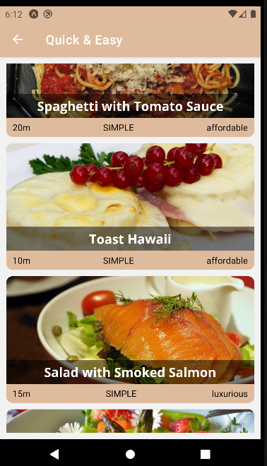
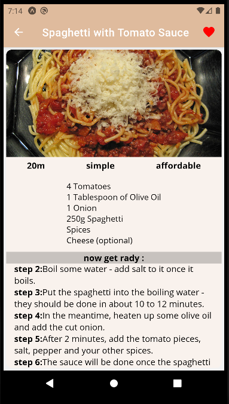

# menu and navigator
 
This app deals with the navigation of values and cruises of a user in the app on the page there are categories of foods that the user is interested in which those categories are responsive and can be clicked on

After the user clicks on a food category that is better, he will be presented with a list of foods for the same category. Here, too, each food is responsive and can be clicked on for more details.

On this page you can see that the user has selected a dish and can now add it to his favorites in order to prepare later.

